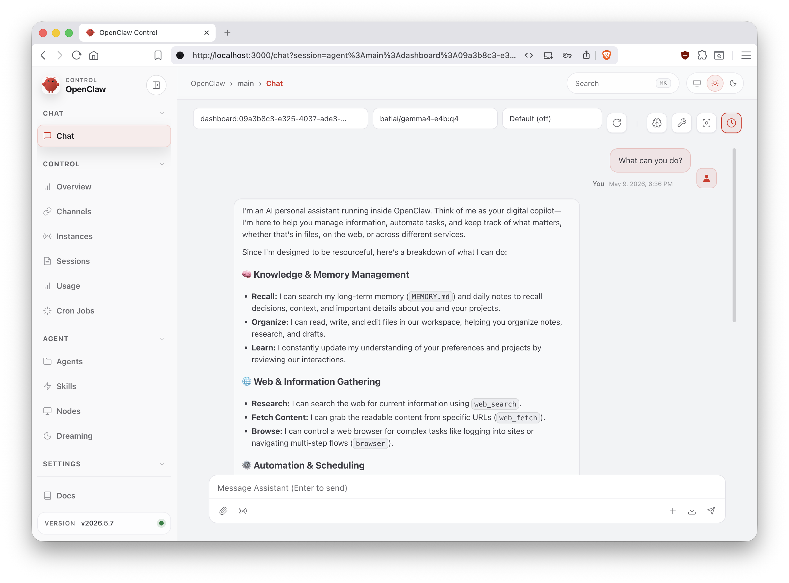
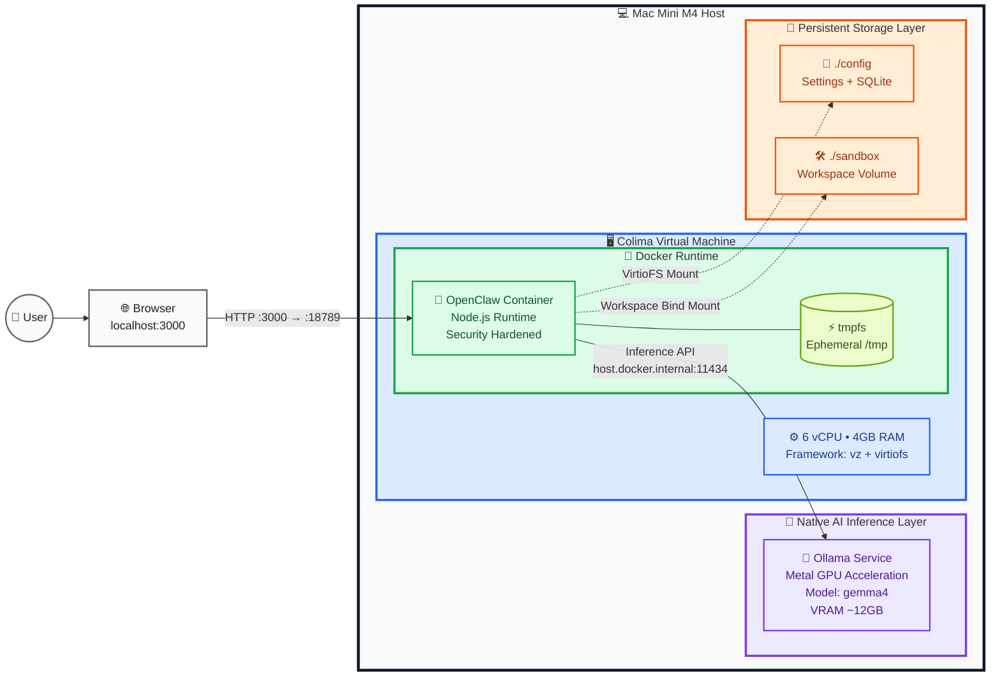

# 🦞 OpenClaw Sandbox - Mac Mini M4 (16GB)

[English](README.md) / [中文](README.zh.md)

**OpenClaw Sandbox** is a highly optimized local AI Agent development and execution environment, deeply customized for **Apple Silicon (M4 chip)** hardware features. It aims to provide a **low-power, high-performance, and high-privacy** local inference solution. By physically and logically decoupling the inference engine (Ollama) from the execution logic (OpenClaw), we have successfully achieved smooth operation of complex long-context AI workflows even under the 16GB unified memory limitation.



> 💡 **Project Positioning & Core Purpose**
> This is a sandbox environment configuration guide optimized specifically for the **Apple Mac Mini M4 (16GB RAM)**, intended to provide a structured and easy-to-understand reference manual.
> This project serves primarily as a sandbox for **exploration and learning**, helping **individual users** and developers quickly get started and intuitively understand the basic principles, operating mechanisms, and hybrid architecture design of OpenClaw with very low hardware barriers.

⚠️ **Please Note: This project configuration is NOT for production use.**
Due to the physical bottleneck of 16GB unified memory, the concurrent processing limitations of single-node local LLMs, and the lack of enterprise-grade high availability (HA), rigorous data security, and distributed scheduling in a sandbox environment, do not apply this solution directly to formal production services. To deploy OpenClaw or similar AI Agent services in production, it is recommended to use professional server clusters or cloud-native infrastructure, accompanied by robust monitoring, authentication, and load balancing systems.

---

## Project Structure

```text
.
├── config/                  # Stores tokens, history, and learned knowledge (Ignored by Git)
│   ├── memory/              # SQLite databases
│   └── openclaw.json        # Auto-generated configuration with Access Token
├── sandbox/                 # The Agent's isolated workspace for file operations (Ignored by Git)
├── .env.example             # Example environment variables
├── docker-compose.yml       # Docker Compose configuration for OpenClaw
├── Makefile                 # Make commands for setup and maintenance
├── start.sh                 # One-click start script
├── feature.png              # Project feature image
├── README.md                # English documentation
└── README.zh.md             # Chinese documentation
```

## 📋 I. Prerequisites

Before starting, ensure your macOS has the following core components installed. This project is specifically optimized for Apple Silicon and the M4 unified memory architecture.

### 1. Required Dependencies

I recommend macOS users use `brew` to install dependencies.

| Tool | Purpose | Installation Check |
| :--- | :--- | :--- |
| **Homebrew** | macOS Package Manager | `brew --version` |
| **Ollama** | Local LLM Inference Engine (Native) | `ollama --version` |
| **Colima** | Lightweight Docker VM (Optimized for M4) | `colima --version` |
| **Docker CLI** | Container operation CLI | `docker --version` |

---

### 2. Installation Steps

Alternatively, you can use `make` to automatically install dependencies (refer to the Makefile; it's recommended to check the specific commands first):

```bash
❯ make
Usage: make [target]

Targets:
clean           Kill Ollama memory runners
help            Show this help message
install         Install dependencies (ollama, colima, docker, etc) 
start           Stop existing services, clean runners, and start Colima/OpenClaw
stop            Stop OpenClaw containers and Colima
```

### 3. Manual Installation Steps

* **Step 1: Install Homebrew** (if not installed):

    ```bash
    /bin/bash -c "$(curl -fsSL https://raw.githubusercontent.com/Homebrew/install/HEAD/install.sh)"
    ```

* **Step 2: Install Ollama**:

    ```bash
    brew install ollama
    # Start the service
    ollama serve
    ```

* **Step 3: Pull Recommended Models**:

    ```bash
    # Balanced model recommended for 16GB devices
    ollama pull batiai/gemma4-e4b:q4
    ```

* **Step 4: Install Colima & Docker**:

    ```bash
    brew install colima docker docker-compose
    ```

* **Step 5: Configure Environment Variables**:

    Copy the example environment file and modify as needed (especially UID/GID):

    ```bash
    cp .env.example .env
    ```

---

## 🚀 II. Getting Started

### 1. One-Click Start (Recommended)

The environment is fully automated. Use the provided script to ensure all memory caches are cleared and Colima starts with the correct hardware flags.

```bash
chmod +x start.sh
./start.sh
```

### 2. Manual Start Steps

If you need manual control, follow these steps in order:

* **Start Colima**:

    ```bash
    colima start --cpu 6 --memory 4 --vm-type=vz --mount-type=virtiofs
    ```

* **Start Docker Stack**:

    ```bash
    docker-compose up -d
    ```

### 3. Access Web UI

* **URL**: [http://localhost:3000](http://localhost:3000)
* **Access Token**: Automatically generated after the first run, usually saved in `config/openclaw.json`:

```json
{
  "gateway": {
    "auth": {
      "mode": "token",
      "token": "YOUR_GENERATED_TOKEN_HERE"
    }
  }
}
```

---

## 🗺️ III. Architecture Overview

### 1. Why Hybrid Architecture?

Running **Ollama natively** on Apple Silicon significantly improves Metal GPU utilization and reduces file I/O latency.

| Component | Execution Environment | Core Responsibility |
| :--- | :--- | :--- |
| **Ollama** | macOS Host (Native) | GPU Accelerated Inference (Metal GPU) |
| **Colima VM** | Virtualization Layer (vz) | Provides lightweight Linux environment |
| **OpenClaw** | Docker Container | AI Agent logic orchestration & sandbox isolation |

### 2. Why Colima instead of Docker Desktop?

On a 16GB Mac Mini, every megabyte of RAM matters. Colima offers significant advantages over Docker Desktop:

* **Lower Memory Overhead**: Colima is a lightweight VM without heavy background processes, freeing up more memory for local LLMs (Ollama).
* **Better Apple Silicon Integration**: By using macOS's native `vz` virtualization framework, Colima runs with minimal CPU overhead.
* **Superior File I/O Performance**: With `virtiofs`, the Agent's speed for reading/writing code in `./sandbox` is close to native disk speed, which is crucial for AI workflows involving frequent compilation and execution.
* **Hard Resource Limits**: Colima allows precise control over VM resource usage, ensuring Docker never "cannibalizes" the unified GPU memory belonging to Ollama.

### 3. System Diagram



---

## 🧠 IV. Memory & Context Management

In the 16GB Unified Memory (UMA) architecture, preventing memory fragmentation and Swap is key to maintaining performance.

### 1. ⚠️ RAM Monitoring Levels

Please run `ollama ps` regularly to check memory status:

| Status | Context Size | Memory Usage | System Performance |
| :--- | :--- | :--- | :--- |
| **Healthy** | 4096 (4k) | ~5.8GB | Runs smoothly |
| **Warning** | 32k - 131k | ~9GB+ | Slight latency begins to appear |
| **Critical** | 262k+ | ~18GB+ | Severe system lag (Swap) |

### 2. Optimization Tips

* **Context Size**: Recommended to limit to around **8192** for best stability.
* **Model Selection**: Recommended to use **3B ~ 4B Q4 quantized models**.

---

## ⚙️ V. Configuration Details

### 1. Core Model Configuration

* **Primary Model**: `batiai/gemma4-e4b:q4` (approx. 5.3GB VRAM)
* **Alternative Models**: `qwen3.5:2b`, `qwen3.5:4b` (4k custom context variants)

### 2. Key Environment Variables (Docker Compose)

* `OPENCLAW_PROVIDERS_OLLAMA_NUM_CTX=4096`: Forces a 4k context limit request.
* `OPENCLAW_AGENTS_DEFAULTS_THINKING=low`: Optimizes response speed.
* `shm_size: '2gb'`: Allocates sufficient shared memory for browser automation.

---

## 📂 VI. Directory Roles

* **`config/`**: Maps to `/home/node/.openclaw`. Stores tokens, history, and learned knowledge. *Ignored by Git.*
* **`sandbox/`**: Maps to `/home/node/.openclaw/workspace`. The Agent's isolated workshop. *Ignored by Git.*

---

## 🛠️ VII. Maintenance Commands

| Goal | Command |
| :--- | :--- |
| **Full Cleanup & Restart** | `./start.sh` |
| **Gracefully Stop All Services** | `docker-compose down` |
| **Clear History & Cache** | `docker-compose down -v && rm config/memory/main.sqlite` |
| **Check Model Status** | `ollama ps` |

---

## 🔧 VIII. Troubleshooting

| Problem | Solution |
| :--- | :--- |
| **System is lagging** | Execute `pkill -9 -f "ollama runner"` to force release memory, then restart. |
| **Docker cannot connect to host** | Run `colima restart` and check if `host.docker.internal` is resolvable. |
| **Model not responding / Timeout** | Run `ollama ps` to see if a model is loading, or try restarting the Ollama service. |
| **Browser automation crashes** | Check if `shm_size` in `docker-compose.yml` is set to `2gb` or more. |
| **Permission Denied** | Ensure the host directory is owned by the current user and the container starts with `user: "501:20"`. |

---

## ⚠️ IX. Known Limitations

As an AI Infra project, we must transparently point out the physical constraints in a 16GB unified memory environment:

* **Memory Capacity Bottleneck**: 16GB UMA is still tight when handling extremely large context inference compared to 32GB/64GB models.
* **Context Risks**: Context windows of 131k+ easily trigger system Swap (disk paging), leading to a massive drop in inference speed.
* **Multi-model Limitations**: **Strongly discouraged** to run multiple models simultaneously or execute heavy tasks concurrently.
* **Browser Automation**: Playwright/Puppeteer consumes significant memory spikes when active, which may squeeze inference space.
* **Long-term Maintenance**: Ollama Runners running for extended periods may not release memory completely; periodic manual resets according to the maintenance table are recommended.

---
