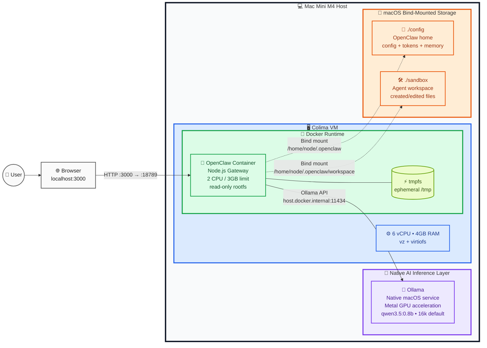

# 🦞 OpenClaw Sandbox - Mac Mini M4 (16GB)

[English](README.md) / [中文](README.zh.md)

**OpenClaw Sandbox** 是一个高度优化的本地 AI Agent 开发与运行环境，专为 **Apple Silicon (M4 芯片)** 硬件特性深度定制，旨在提供一套**低功耗、高性能、强隐私**的本地推理方案。通过将推理引擎 (Ollama) 与执行逻辑 (OpenClaw) 进行物理与逻辑的双重解耦，我们成功实现了在 16GB 统一内存的限制下，依然能流畅运行复杂的长上下文 AI 工作流。


> 💡 **项目定位与核心目的**
> 这是一个专为 **Apple Mac Mini M4 (16GB RAM)** 优化的沙箱环境配置指南，旨在提供一份结构化、易于理解的参考手册。
> 本项目主要作为**探索和学习**的沙箱环境，帮助**个人用户**和开发者以极低的硬件门槛，快速上手并直观了解 OpenClaw 的基本原理、运行机制及混合架构设计。

⚠️ **请注意：本项目配置不适合真正的生产环境 (Not for Production Use)。**
受限于 16GB 统一内存的物理瓶颈、单节点本地大模型的并发处理能力，以及沙箱环境在企业级高可用性（HA）、严苛的数据安全和分布式调度等方面的缺失，请勿将此方案直接应用于正式的生产业务中。如需在生产环境中部署 OpenClaw 或类似 AI Agent 服务，建议采用专业的服务器集群或云原生基础设施，并搭配完善的监控、鉴权与负载均衡体系。

---

## 项目结构 (Project Structure)

```text
.
├── config/                  # 存储令牌、历史记录和已学知识 (Git 已忽略)
│   ├── memory/              # SQLite 数据库
│   └── openclaw.json        # 自动生成的配置，包含 Access Token
├── sandbox/                 # Agent 进行文件操作的隔离工作区 (Git 已忽略)
├── .env.example             # 示例环境变量
├── docker-compose.yml       # OpenClaw 的 Docker Compose 配置
├── Makefile                 # 用于设置和维护的 Make 命令
├── feature.png              # 项目功能图
├── README.md                # 英文文档
└── README.zh.md             # 中文文档
```

## 📋 一、环境准备 (Prerequisites)

在开始之前，请确保您的 macOS 已安装以下核心组件。本项目专门针对 Apple Silicon 和 M4 统一内存架构进行了优化。

### 1. 必需依赖 (Required Dependencies)

我建议 macOS 用户使用 `brew` 来安装依赖。

| 工具           | 用途                                | 安装状态检查       |
| :------------- | :---------------------------------- | :----------------- |
| **Homebrew**   | macOS 包管理器                      | `brew --version`   |
| **Ollama**     | 本地 LLM 推理引擎 (原生运行)        | `ollama --version` |
| **Colima**     | 轻量级 Docker 虚拟机 (针对 M4 优化) | `colima --version` |
| **Docker CLI** | 容器操作命令行工具                  | `docker --version` |
| 工具 | 用途 | 安装状态检查 |
| :--- | :--- | :--- |
| **Homebrew** | macOS 包管理器 | `brew --version` |
| **Ollama** | 本地 LLM 推理引擎 (原生运行) | `ollama --version` |
| **Colima** | 轻量级 Docker 虚拟机 (针对 M4 优化) | `colima --version` |
| **Docker CLI** | 容器操作命令行工具 | `docker --version` |

---

### 2. 安装步骤

或者你可以使用 `make` 自动安装依赖 (Makefile)（建议先看看具体的命令）:

    ```bash
    ❯ make
    Usage: make [target]

    Targets:
      clean           Kill Ollama model runners
      help            Show this help message
      install         Install dependencies (ollama, colima, docker), pull model, and setup .env
      ollama-start    Start Ollama with VRAM limit (run this in a separate terminal)
      ollama-stop     Stop the Ollama server
      reset           Wipe all data (config/sandbox) and start fresh
      start           Stop existing services, clean runners, and start Colima/OpenClaw
      stop            Stop OpenClaw containers and Colima

    ```

### 2. 手动安装步骤

* **Step 1: 安装 Homebrew** (若未安装):

    ```bash
    /bin/bash -c "$(curl -fsSL https://raw.githubusercontent.com/Homebrew/install/HEAD/install.sh)"
    ```

* **Step 2: 安装 Ollama**:

    ```bash
    brew install ollama
    # 启动服务
    ollama serve
    ```

* **Step 3: 拉取推荐 Demo 模型**:

    ```bash
    # 本 Demo 沙箱默认使用的轻量模型
    ollama pull qwen3.5:0.8b
    ```

* **Step 4: 安装 Colima & Docker**:

    ```bash
    brew install colima docker docker-compose
    ```

* **Step 5: 配置环境变量**:

    复制示例环境文件并根据需要修改 (特别是 UID/GID):

    ```bash
    cp .env.example .env
    ```

---

## 🚀 二、快速启动指南 (Getting Started)

### 1. Makefile 启动 (推荐)

环境已通过 Makefile 自动化。使用 `make start` 停止现有服务、清理 Ollama runners、按优化参数启动 Colima、预配置 OpenClaw，并启动容器堆栈。

```bash
make start
```

### 2. 手动启动步骤

如果您需要手动控制，请按顺序执行：

* **启动 Colima**:

    ```bash
    colima start --cpu 6 --memory 4 --vm-type=vz --mount-type=virtiofs
    ```

* **启动 Docker 堆栈**:

    ```bash
    docker-compose up -d
    ```

### 3. 访问 Web UI

* **URL**: [http://localhost:3000](http://localhost:3000)
* **Access Token**: 首次运行后自动生成，通常保存在 `config/openclaw.json` 中：

```json
{
  "gateway": {
    "auth": {
      "mode": "token",
      "token": "YOUR_GENERATED_TOKEN_HERE"
    }
  }
}
```

---

## 🗺️ 三、系统架构概览 (Architecture Overview)

### 1. 为什么采用混合架构？

在 Apple Silicon 上，**原生运行 Ollama** 能够显著提升 Metal GPU 的利用率并降低文件 I/O 延迟。

| 组件          | 运行环境              | 核心职责                    |
| :------------ | :-------------------- | :-------------------------- |
| **Ollama**    | macOS 宿主机 (Native) | GPU 加速推理 (Metal GPU)    |
| **Colima VM** | 虚拟化层 (vz)         | 提供轻量级 Linux 运行环境   |
| **OpenClaw**  | Docker 容器           | AI Agent 逻辑编排与沙箱隔离 |

### 2. 为什么选择 Colima 而不是 Docker Desktop？

在 16GB 内存的 Mac Mini 上，每一兆内存都至关重要。Colima 相比 Docker Desktop 具有显著优势：

* **更低的内存开销 (Lower Memory Overhead)**: Colima 是轻量级的虚拟机，不会产生沉重的后台进程，为本地 LLM (Ollama) 腾出了更多的可用内存。
* **原生 Apple Silicon 优化 (Better Integration)**: 通过使用 macOS 原生的 `vz` 虚拟化框架，Colima 能够以极低的 CPU 损耗运行。
* **卓越的文件 I/O 性能 (Better virtiofs Performance)**: 借助于 `virtiofs`，Agent 在 `./sandbox` 中读写代码的速度接近原生磁盘，这对于频繁编译和运行代码的 AI 工作流至关重要。
* **资源硬限制**: Colima 允许我们精确控制虚拟机的资源占用，确保 Docker 永远不会“蚕食”掉属于 Ollama 的 GPU 统一内存。

### 3. 系统架构图 (System Diagram)



---

## 🧠 四、内存与上下文管理 (Memory & Context)

在 16GB 统一内存 (UMA) 架构下，防止内存压力和 Swap 是保持性能的关键。更大的上下文窗口可以保留更长的对话，但也会增加延迟和内存压力；它**不会**让小模型的推理能力变强。

### 1. ⚠️ 内存监控分级 (RAM Monitoring)

请定期运行 `ollama ps` 查看已加载模型和当前上下文：

| 状态                | CONTEXT 大小 | 内存占用 | 系统表现            |
| :------------------ | :----------- | :------- | :------------------ |
| **推荐 (Recommended)** | 16384 (16k) | 中等内存占用 | 适合作为 16GB Demo 环境的默认值 |
| **实验 (Experimental)** | 24576 - 32768 (24k - 32k) | 更高内存压力 | 适合更长对话；需要观察 macOS 内存压力 |
| **高风险 (Risky)** | 65536+ (64k+) | 较重内存压力 | 在 16GB 机器上可能变慢或不稳定 |
| **不推荐 (Not recommended)** | 131k - 262k | 很重内存压力 | 模型理论支持，但这台机器大概率不舒服 |

### 2. 优化建议

* **上下文大小**: 本 Demo 默认限制为 **16384**，给 OpenClaw 的 Agent 指令、会话状态和工具上下文留出足够空间，同时仍适合轻量 Demo 模型。
* **模型选择**: 本仓库默认使用轻量 Demo 模型 **`qwen3.5:0.8b`**。如需更高质量，可切换到 **`qwen3.5:4b`**，但会带来更高内存压力。
* **质量 vs 上下文**: 增大上下文主要帮助更长的对话，不会修复算术或推理质量。如果 `qwen3.5:0.8b` 给出明显错误答案，应优先考虑 `qwen3.5:4b`，而不是只增大上下文。
* **实测基线**: 在 Mac Mini M4 16GB 上，`qwen3.5:0.8b` 使用 16k 上下文时，Ollama 中模型约 `2.4GB`，OpenClaw 容器约 `538MiB / 3GiB`，同时 macOS 已经有明显内存压缩。因此 **32k** 可以作为实验值，但不适合作为更稳妥的默认值。
* **32k 测试**: 如需测试 32k，请同时在 `docker-compose.yml` 设置 `OPENCLAW_PROVIDERS_OLLAMA_NUM_CTX=32768`，并在 `config/openclaw.json` 设置 `"contextTokens": 32768`，然后重启 OpenClaw。

### 3. 硬件选型建议 (Hardware Sizing)

本仓库面向 **Mac Mini M4 16GB 统一内存**，它非常适合做本地 OpenClaw Demo，但不适合作为长期运行本地大模型的主力工作站。对于 Ollama + OpenClaw 来说，内存容量和内存带宽通常比单纯 CPU 更关键。

| 目标 | 推荐 Mac 档位 | RAM | SSD | 实用模型范围 | 实用上下文 |
| :--- | :--- | :--- | :--- | :--- | :--- |
| 类似本仓库的轻量 Demo | Mac Mini M4 | 16GB | 512GB - 1TB | 0.5B - 4B | 16k 默认，32k 实验 |
| 更舒服的本地 Agent | Mac Mini M4 Pro / Mac Studio M4 Max | 32GB - 36GB+ | 1TB+ | 4B - 8B | 16k - 32k |
| 推荐日常主力配置 | Mac Studio M4 Max | 64GB | 1TB - 2TB | 8B - 14B | 32k - 64k |
| 严肃本地大模型配置 | Mac Studio M4 Max / M3 Ultra | 96GB - 128GB+ | 2TB+ | 14B - 32B | 稳定时可尝试 64k |
| 发烧级本地实验 | 高内存 Mac Studio Ultra | 192GB+ | 4TB+ | 32B - 70B 量化模型 | 取决于模型和速度容忍度 |

对于本仓库当前机器，实际定位是：

```text
Mac Mini M4
CPU/GPU: 10-core CPU / 10-core GPU
RAM: 16GB unified memory
SSD: 512GB or 1TB
Model: qwen3.5:0.8b or qwen3.5:4b
Context: 16k default, 32k experimental
```

如果你希望 OpenClaw 更像一个可靠的日常本地助手，可以稳定处理文件、工具调用、代码和推理，甜点配置更接近：

```text
Mac Studio M4 Max
RAM: 64GB unified memory
SSD: 2TB
Model: 8B - 14B
Context: 32k - 64k
```

---

## ⚙️ 五、配置细节详解 (Configuration Details)

### 1. 核心模型配置

* **主 Demo 模型 (Primary)**: `qwen3.5:0.8b`
* **可选更大模型 (Alternative)**: `qwen3.5:4b`，质量更高但内存成本更高

### 2. 关键环境变量 (Docker Compose)

* `OPENCLAW_PROVIDERS_OLLAMA_NUM_CTX=16384`: 为本地 Ollama 模型请求 16k 上下文窗口。
* `OPENCLAW_AGENTS_DEFAULTS_MODEL_PRIMARY=ollama/qwen3.5:0.8b`: 设置 Demo 模型。
* `agents.defaults.thinkingDefault=off`: 为小型本地模型减少 smoke-test 提示词开销。
* `agents.defaults.experimental.localModelLean=true`: 为较弱本地模型移除较重的默认工具上下文。
* `tools.profile=coding`: 保留文件/工作区能力，同时避免使用更重的 full 工具配置。
* `shm_size: '2gb'`: 为浏览器自动化分配充足的共享内存。

---

## 📂 六、项目文件结构 (Directory Roles)

* **`config/`**: 映射至 `/home/node/.openclaw`。存储令牌、历史记录、已学知识。*Git 已忽略。*
* **`sandbox/`**: 映射至 `/home/node/.openclaw/workspace`。Agent 的隔离工作坊。*Git 已忽略。*

---

## 🛠️ 七、维护命令汇总 (Maintenance)

| 目标                 | 命令                                                     |
| :------------------- | :------------------------------------------------------- |
| **完全清理并重启**   | `make start`                                             |
| **优雅停止所有服务** | `docker-compose down`                                    |
| **清除历史与缓存**   | `docker-compose down -v && rm config/memory/main.sqlite` |
| **检查模型状态**     | `ollama ps`                                              |

---

## 🔧 八、故障排除 (Troubleshooting)

| 问题 (Problem)                   | 解决方案 (Solution)                                                 |
| :------------------------------- | :------------------------------------------------------------------ |
| **系统运行卡顿**                 | 执行 `pkill -9 -f "ollama runner"` 强制释放内存，并重启。           |
| **Docker 无法连接宿主机**        | 运行 `colima restart` 并检查 `host.docker.internal` 是否可解析。    |
| **模型没有响应 / 超时**          | 运行 `ollama ps` 检查是否有正在加载的模型，或尝试重启 Ollama 服务。 |
| **浏览器自动化崩溃**             | 检查 `docker-compose.yml` 中的 `shm_size` 是否设置为 `2gb` 以上。   |
| **权限错误 (Permission Denied)** | 确保宿主机目录所有者为当前用户，且容器以 `user: "501:20"` 启动。    |

---

## ⚠️ 九、已知限制 (Known Limitations)

作为 AI Infra 项目，我们必须透明地指出在 16GB 统一内存环境下的物理约束：

* **内存容量瓶颈**: 16GB UMA 在处理超大上下文推理时仍显局促，无法与 32GB/64GB 机型相比。
* **上下文风险**: 131k+ 的上下文窗口极易触发系统 Swap（磁盘交换），导致推理速度断崖式下跌。
* **多模型限制**: **强烈不建议**同时运行多个模型或并发执行繁重任务。
* **浏览器自动化**: Playwright/Puppeteer 开启时会产生显著的内存峰值，可能挤占推理空间。
* **长期运行维护**: 长时间运行的 Ollama Runner 可能会出现内存无法完全释放的情况，建议根据维护表定期手动重置。

---
